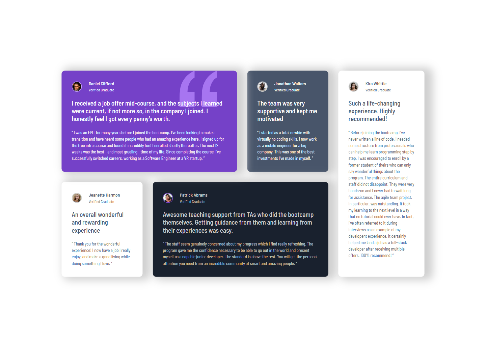

# Frontend Mentor - Testimonials grid section solution

This is a solution to the [Testimonials grid section challenge on Frontend Mentor](https://www.frontendmentor.io/challenges/testimonials-grid-section-Nnw6J7Un7). Frontend Mentor challenges help you improve your coding skills by building realistic projects.

## Table of contents

- [Overview](#overview)
  - [The challenge](#the-challenge)
  - [Screenshot](#screenshot)
  - [Links](#links)
- [My process](#my-process)
  - [Built with](#built-with)
  - [What I learned](#what-i-learned)
- [Author](#author)

## Overview

### The challenge

Users should be able to:

- View the optimal layout for the site depending on their device's screen size

### Screenshot

#### Desktop



#### Mobile


### Links

- Solution URL: [Frontend Mentor]()
- Live Site URL: [GitHub]()

## My process

### Built with

- Semantic HTML5 markup
- CSS custom properties
- Flexbox
- CSS Grid
- Mobile-first workflow

### What I learned

I learned how to put the elements in certain order, e.g. in this case I had to put the quotation sign behind the text so I got to work with z-index.

```css
.pattern {
  display: inline;
  position: absolute;
  right: 60px;
  top: 0;
  height: 108px;
  z-index: 0;
}

#daniel {
  position: relative;
  grid-area: post1;
  max-width: 460px;
}

#daniel .post-header {
  position: relative;
  z-index: 1;
}
```

## Author

- Frontend Mentor - [@anhvu1012](https://www.frontendmentor.io/profile/anhvu1012)
